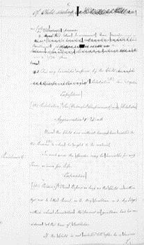

# Dataset Agnostic Word Segmentation

TensorFlow implementation of [Towards A Dataset Agnostic Word Segmentation](https://sites.google.com/view/tdsas/home)segmentation system for document images.

## Usage

#### Train

    python main.py --name train_example --train-hmap --train-regression --iters 100000 --dataset iamdb  --data_type train --gpu_id 0

#### Evaluation

    python main.py --name train_example --eval-run --iters 500 --dataset iamdb  --data_type val1 --gpu_id 0

#### Expected output
|   |  |
|:---:|:---:|
| Original Document (Bentham) | Heatmap (Bentham) |

#### Dependencies
* Python 2.7
* TensorFlow 1.3
* OpenCV
* CUDA

Also see requirements.txt

#### License

Code is released under the MIT License (refer to the LICENSE file for details).

## Data

You can load several datasets automaticly by passing two commandline flags:

1. dataset
2. data_type
3. data_type_prob

Possible values for the dataset flag are **'iamdb', 'iclef', 'botany', 'icdar' and 'from-pkl-folder'** see below for further details. Available data_type values are **'train', 'val1', 'val2' and 'test'**
you can mix several data_types by passing a string where each type is separated by '#'. Multiple data types will be sampled uniformly unless you pass
a string of probabilities to 'dtype_mix_prob' separated by '#' (NOTICE: string must be same length as data_type string)

For example:

    python main.py ... --dataset iamdb  --data_type #train#val1#val2 --data_type_prob #0.75#0.125#0.125

You can change the above by playing with the code in [input_stream.py](settings/input_stream.py)

#### Assumed directory structure for the available datasets

       Root
       └── datasets
           ├── icdar
           ├── iclef
           ├── iamdb
           ├── botany
           └── botany

You probably want to use a symlinks and not to keep the data in the repo directory

    cd datasets
    ln -s /path/to/icdar icdar

#### ICDAR2013
* Available for download from [here](http://users.iit.demokritos.gr/~nstam/ICDAR2013HandSegmCont/BenchmarkingDataset/) (You need the images and word ground truth data)
* Open the rar files to the following directory structure:

        datasets/icdar
        ├── gt_words_test
        ├── gt_words_train
        ├── images_test
        └── images_train

* Commandline flags: dataset 'icdar' as value to dataset flag, available values for data_type are {train, val1, test}

* Binary ground truth data converted to bounding box coordinates are available as a pkl from [here]

You can get dataset splits and cached Numpy arrays of bounding box data from [here](https://drive.google.com/drive/folders/1QnDWjB2WmBIrNrE8lDvSJ99Oj8_TaMZq?usp=sharing)

#### IAM Database

* Available for download from [here](http://www.fki.inf.unibe.ch/databases/iam-handwriting-database/download-the-iam-handwriting-database) (registration is required)

* Make sure you have the following directory structure:

       datasets/iamdb
        ├── ascii
        ├── forms
        ├── lines
        ├── sentences
        ├── words
        └── xml

* Commandline flags: dataset 'iamdb' as value to dataset flag, available values for data_type are {train, val1, val2, test}

You can get dataset splits from [here](https://drive.google.com/drive/folders/1QnDWjB2WmBIrNrE8lDvSJ99Oj8_TaMZq?usp=sharing)

#### Bentham dataset (iclef)

* Available for download from [here](https://zenodo.org/record/52994)

* Make sure you have the following directory structure:

       datasets/iclef
        ├── bboxs_train_for_query-by-example.txt
        ├── pages_devel_jpg
        ├── pages_devel_xml
        ├── pages_test_jpg
        ├── pages_test_xml
        ├── pages_train_jpg
        └── pages_train_xml

* Commandline flags: dataset 'iamdb' as value to dataset flag, available values for data_type are {train, val1, val2, test}

You can get dataset splits from [here](https://drive.google.com/drive/folders/1QnDWjB2WmBIrNrE8lDvSJ99Oj8_TaMZq?usp=sharing)

#### Botany

* Available for download from [here](https://www.prhlt.upv.es/contests/icfhr2016-kws/data.html)

* Make sure you have the following directory structure:

       datasets/botany
       ├── Botany_Train_III_PageImages
       ├── Botany_Train_II_PageImages
       ├── Botany_Train_I_PageImages
       ├── Botany_Test_PageImages
       └── xml
           ├── Botany_Train_III_WL.xml
           ├── Botany_Train_II_WL.xml
           ├── Botany_Train_I_WL.xml
           └── Botany_Test_GT_SegFree_QbS.xml
